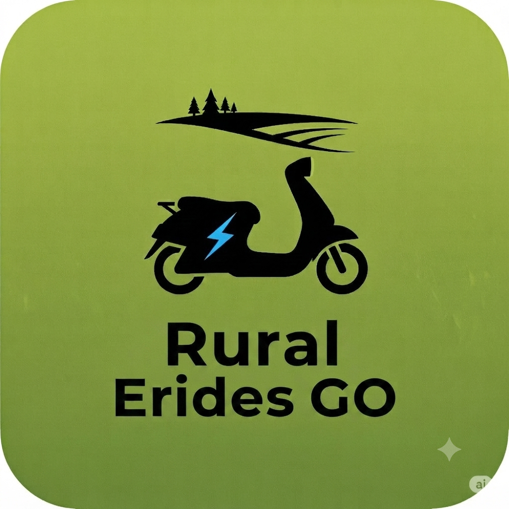

<!DOCTYPE html>
<html lang="en" class="dark">
<head>
  <meta charset="UTF-8">
  <meta name="viewport" content="width=device-width, initial-scale=1.0">
  <title>Rural ERides Go | Official Telemetry &amp; Copilot Suite</title>
  
  
  
  
</head>
<body class="bg-[#06060a] text-white min-h-screen flex flex-col justify-between grid-bg selection:bg-[#39ff14] selection:text-black">

  <!-- HEADER NAVIGATION -->
  <header class="border-b border-zinc-900/80 bg-[#06060a]/90 backdrop-blur-md sticky top-0 z-50">
    

      

        

          
          
RE

        

        

          Rural ERides Go
          Master Telemetry Suite
        

      

      
      

        <a href="https://youtube.com/@bradleycallison" target="_blank" rel="noopener noreferrer" class="hidden sm:flex items-center gap-2 bg-zinc-900/90 border border-zinc-800 hover:border-[#39ff14]/50 px-4 py-2.5 rounded-xl text-xs font-black uppercase tracking-widest text-zinc-300 hover:text-[#39ff14] transition-colors">
          <svg class="w-4 h-4 text-rose-500 fill-current" viewBox="0 0 24 24"><path d="M23.498 6.186a3.016 3.016 0 0 0-2.122-2.136C19.505 3.5 12 3.5 12 3.5s-7.505 0-9.377.55a3.016 3.016 0 0 0-2.122 2.136C0 8.07 0 12 0 12s0 3.93.501 5.814a3.016 3.016 0 0 0 2.122 2.136c1.871.55 9.376.55 9.376.55s7.505 0 9.377-.55a3.016 3.016 0 0 0 2.122-2.136C24 15.93 24 12 24 12s0-3.93-.502-5.814zM9.545 15.568V8.432L15.818 12l-6.273 3.568z"/></svg> @bradleycallison
        </a>
        <a href="https://github.com" target="_blank" rel="noopener noreferrer" class="bg-[#39ff14] text-black px-5 py-2.5 rounded-xl text-xs font-black uppercase tracking-widest glow-brand hover:opacity-90 transition-all font-mono">
          GitHub Repo
        </a>
      

    

  </header>

  <!-- HERO SECTION -->
  <section class="relative overflow-hidden py-16 lg:py-24">
    

    

      
      

        

          <svg class="w-4 h-4" fill="none" stroke="currentColor" stroke-width="2" viewBox="0 0 24 24"><path stroke-linecap="round" stroke-linejoin="round" d="M9 12l2 2 4-4m5.618-4.016A11.955 11.955 0 0112 2.944a11.955 11.955 0 01-8.618 3.04A12.02 12.02 0 003 9c0 5.591 3.824 10.29 9 11.622 5.176-1.332 9-6.03 9-11.622 0-1.042-.133-2.052-.382-3.016z"/></svg> Developed by Lord Bradley Callison
        

        <h1 class="text-4xl sm:text-6xl font-black uppercase tracking-tight leading-none">
          The Ultimate Micro-Mobility Operating System.
        </h1>

        

          A production-grade React, Vite, and Capacitor application built for advanced electric personal vehicle (PEV) telemetry, real-time weather analytics, secure AI mechanical diagnostics, and sub-meter field tracking.
        

        

          <a href="#features" class="bg-[#39ff14] text-black px-8 py-4 rounded-2xl font-black uppercase tracking-widest text-xs glow-brand hover:opacity-90 transition-all flex items-center gap-2 font-mono">
            <svg class="w-4 h-4" fill="none" stroke="currentColor" stroke-width="2" viewBox="0 0 24 24"><path stroke-linecap="round" stroke-linejoin="round" d="M19 11H5m14 0a2 2 0 012 2v6a2 2 0 01-2 2H5a2 2 0 01-2-2v-6a2 2 0 012-2m14 0V9a2 2 0 00-2-2M5 11V9a2 2 0 012-2m0 0V5a2 2 0 012-2h6a2 2 0 012 2v2M7 7h10"/></svg> Explore Architecture
          </a>
          <a href="#bio" class="bg-zinc-900 border border-zinc-800 hover:border-zinc-700 px-8 py-4 rounded-2xl font-black uppercase tracking-widest text-xs text-white transition-all flex items-center gap-2 font-mono">
            <svg class="w-4 h-4 text-[#39ff14]" fill="none" stroke="currentColor" stroke-width="2" viewBox="0 0 24 24"><path stroke-linecap="round" stroke-linejoin="round" d="M16 7a4 4 0 11-8 0 4 4 0 018 0zM12 14a7 7 0 00-7 7h14a7 7 0 00-7-7z"/></svg> Creator Bio &amp; Fleet
          </a>
        

      

      <!-- TELEMETRY HUD PREVIEW CARD -->
      

        

          

          
          

            

              
              Live Telemetry HUD
            

            S25 Plus Rig
          

          

            
Speed Vector

            
38.4

            
Miles / Hour

          

          

            

              
Pack Voltage

              
52.4V

            

            

              
Battery State

              
94%

            

            

              
Power Draw

              
1,420W

            

          

          

            GPS Status: <strong class="text-emerald-400">Locked</strong>
            Rider Radar Active
          

        

      

    

  </section>

  <!-- CREATOR BIO & FLEET SHOWCASE -->
  <section id="bio" class="py-20 bg-zinc-950/60 border-t border-b border-zinc-900">
    

      

        
        

          

            
            
@BRADLEY

          

          

            <h3 class="text-lg font-black uppercase tracking-wide">Lord Bradley Callison</h3>
            Rural Erides Creator (@bradleycallison)
          

          <a href="https://youtube.com/@bradleycallison" target="_blank" rel="noopener noreferrer" class="w-full bg-rose-600 hover:bg-rose-500 text-white py-3 rounded-xl text-xs font-black uppercase tracking-widest transition-colors flex items-center justify-center gap-2 shadow-lg">
            <svg class="w-4 h-4 fill-current" viewBox="0 0 24 24"><path d="M23.498 6.186a3.016 3.016 0 0 0-2.122-2.136C19.505 3.5 12 3.5 12 3.5s-7.505 0-9.377.55a3.016 3.016 0 0 0-2.122 2.136C0 8.07 0 12 0 12s0 3.93.501 5.814a3.016 3.016 0 0 0 2.122 2.136c1.871.55 9.376.55 9.376.55s7.505 0 9.377-.55a3.016 3.016 0 0 0 2.122-2.136C24 15.93 24 12 24 12s0-3.93-.502-5.814zM9.545 15.568V8.432L15.818 12l-6.273 3.568z"/></svg> Visit YouTube Channel
          </a>
        

        

          

            About The Creator &amp; Fleet
            <h3 class="text-2xl sm:text-3xl font-black uppercase tracking-wider">Field-Tested in Stigler, Oklahoma</h3>
            

              Rural ERides Go was forged from real-world micro-mobility testing across Oklahoma terrain. Designed and coded by Lord Bradley Callison, this platform delivers precise telemetry monitoring without relying on closed-ecosystem apps.
            

          

          

            

              Active Personal Fleet
              
Aostirmotor A20 Folding Bike, Geemax E-Trike, isinwheel H7 Pro Scooter, &amp; Engwe Y600.

            

            

              Core Hardware Setup
              
Samsung Galaxy S25 Plus primary filmmaking &amp; mobile telemetry rig paired with dual-device Rider Radar.

            

          

        

      

    

  </section>

  <!-- FEATURE ARCHITECTURE MATRIX -->
  <section id="features" class="py-20">
    

      
      

        System Capabilities
        <h3 class="text-2xl sm:text-4xl font-black uppercase tracking-wider">Advanced Technical Architecture</h3>
      

      

        
        

          

            <svg class="w-6 h-6" fill="none" stroke="currentColor" stroke-width="2" viewBox="0 0 24 24"><path stroke-linecap="round" stroke-linejoin="round" d="M12 8v4l3 3m6-3a9 9 0 11-18 0 9 9 0 0118 0z"/></svg>
          

          <h4 class="text-base font-black uppercase tracking-wide">Live GPS Telemetry</h4>
          

            High-precision speedometers, physics-based incline/decline detection, G-sensor braking force calculations, and cumulative mileage tracking designed for active mobile deployment.
          

        

        

          

            <svg class="w-6 h-6" fill="none" stroke="currentColor" stroke-width="2" viewBox="0 0 24 24"><path stroke-linecap="round" stroke-linejoin="round" d="M3 15a4 4 0 004 4h9a5 5 0 10-.1-9.999 5.002 5.002 0 10-9.78 2.096A4.001 4.001 0 003 15z"/></svg>
          

          <h4 class="text-base font-black uppercase tracking-wide">12-Point Atmospherics</h4>
          

            Real-time weather matrix featuring wind gust vectors, UV solar indexes, surface soil temperatures, dew points, and dynamic ride safety ratings.
          

        

        

          

            <svg class="w-6 h-6" fill="none" stroke="currentColor" stroke-width="2" viewBox="0 0 24 24"><path stroke-linecap="round" stroke-linejoin="round" d="M9 19V6l12-3v13M9 19c0 1.105-1.343 2-3 2s-3-.895-3-2 1.343-2 3-2 3 .895 3 2zm12-3c0 1.105-1.343 2-3 2s-3-.895-3-2 1.343-2 3-2 3 .895 3 2zM9 10l12-3"/></svg>
          

          <h4 class="text-base font-black uppercase tracking-wide">75-Result Audio Engine</h4>
          

            Embedded multi-page YouTube media deck pre-loaded with tailored ride genres ranging from classical piano and theatre organ consoles to synthwave and phonk mixes.
          

        

        

          

            <svg class="w-6 h-6" fill="none" stroke="currentColor" stroke-width="2" viewBox="0 0 24 24"><path stroke-linecap="round" stroke-linejoin="round" d="M10.325 4.317c.426-1.756 2.924-1.756 3.35 0a1.724 1.724 0 002.573 1.066c1.543-.94 3.31.826 2.37 2.37a1.724 1.724 0 001.065 2.572c1.756.426 1.756 2.924 0 3.35a1.724 1.724 0 00-1.066 2.573c.94 1.543-.826 3.31-2.37 2.37a1.724 1.724 0 00-2.572 1.065c-.426 1.756-2.924 1.756-3.35 0a1.724 1.724 0 00-2.573-1.066c-1.543.94-3.31-.826-2.37-2.37a1.724 1.724 0 00-1.065-2.572c-1.756-.426-1.756-2.924 0-3.35a1.724 1.724 0 001.066-2.573c-.94-1.543.826-3.31 2.37-2.37.996.608 2.296.07 2.572-1.065z"/><path stroke-linecap="round" stroke-linejoin="round" d="M15 12a3 3 0 11-6 0 3 3 0 016 0z"/></svg>
          

          <h4 class="text-base font-black uppercase tracking-wide">AI Mechanical Copilot</h4>
          

            Optical image inspection for battery contacts, brake calipers, and controller wiring backed by secure API routing middleware and native Text-to-Speech.
          

        

        

          

            <svg class="w-6 h-6" fill="none" stroke="currentColor" stroke-width="2" viewBox="0 0 24 24"><path stroke-linecap="round" stroke-linejoin="round" d="M19 11H5m14 0a2 2 0 012 2v6a2 2 0 01-2 2H5a2 2 0 01-2-2v-6a2 2 0 012-2m14 0V9a2 2 0 00-2-2M5 11V9a2 2 0 012-2m0 0V5a2 2 0 012-2h6a2 2 0 012 2v2M7 7h10"/></svg>
          

          <h4 class="text-base font-black uppercase tracking-wide">Global PEV Spec Database</h4>
          

            Deep-search technical datasheets and live manufacturer parts sourcing across Amazon, eBay, and multi-vendor networks calibrated for regional pricing.
          

        

        

          

            <svg class="w-6 h-6" fill="none" stroke="currentColor" stroke-width="2" viewBox="0 0 24 24"><path stroke-linecap="round" stroke-linejoin="round" d="M9 20l-5.447-2.724A1 1 0 013 16.382V5.618a1 1 0 011.447-.894L9 7m0 13l6-3m-6 3V7m6 10l4.553 2.276A1 1 0 0021 18.382V7.618a1 1 0 00-.553-.894L15 4m0 13V4m0 0L9 7"/></svg>
          

          <h4 class="text-base font-black uppercase tracking-wide">Dual-Device Rider Radar</h4>
          

            Sub-meter precision tracking enabling multi-device fleet monitoring between mobile phones and field tablets with built-in Ghost Mode privacy protections.
          

        

      

    

  </section>

  <!-- FOOTER -->
  <footer class="border-t border-zinc-900 bg-[#0d0e15] py-12">
    

      

        

        Rural ERides Go v6.5.0 • Developed by Lord Bradley Callison
      

      

        <a href="https://youtube.com/@bradleycallison" target="_blank" rel="noopener noreferrer" class="hover:text-[#39ff14] transition-colors">YouTube Channel</a>
        <a href="https://github.com" target="_blank" rel="noopener noreferrer" class="hover:text-[#39ff14] transition-colors">GitHub Repository</a>
      

    

  </footer>

</body>
</html>
